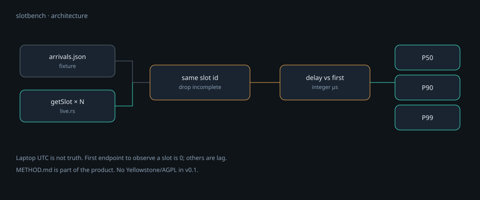
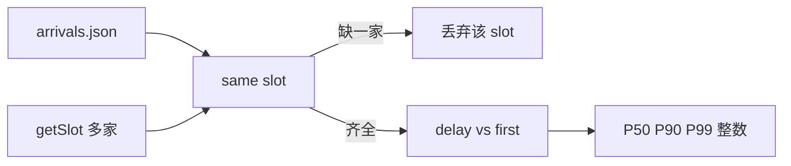

# 学习模块 · slotbench


[封面动画 6s](assets/cover.mp4)

## 架构





```bash
cd slotbench
cargo test
cargo run -- bench --fixture fixtures/arrivals.json
cargo run -- bench --live --config fixtures/config.live.json --samples 2
```

fixture 里 `alpha` 的 p50 应是 0（它总是先到），`beta` 不是 0。

---

## 场景：RPC 快慢为什么是钱

钱包、做市、清算机器人都不自己当验证者，它们问 RPC：「现在哪个 slot？这笔交易进了吗？」  
同一条链，两家供应商看见同一个 slot 的时刻可以差几十到几百毫秒。交易场景里这就是谁先跑掉。

销售会说「我们 P50 全国最低」。没有公开方法的数字，等于广告。本仓库只当秒表。

**Slot** 是 Solana 的时间格子（有点像出块高度，但不完全是以太坊的 block）。`getSlot` 返回节点当前认为的槽位。

---

## 知识点 → 代码落点

| 词 | 人话 | 落在哪 |
|---|---|---|
| 相对到达 | 谁先看见这个 slot，谁是 0；别人是落后的微秒数 | `relative_delays` |
| 本机时钟 | 绝对 UTC 在笔记本上不可信 | 方法文档：不用墙钟当真理 |
| 只比「大家都看见的 slot」 | 缺一家的样本丢掉，不插值 | `present != endpoints` 则 skip |
| 最近秩分位数 | `ceil(p/100*n)-1`，整数 | `percentile_nearest_rank` |
| AGPL | Yellowstone gRPC 客户端常是 AGPL | v0.1 只用 JSON-RPC，不链进传染许可证 |

巧思：我们不测「请求发出到响应」的 RTT 当唯一指标（那混进了你到供应商的网）。我们对齐**同一个 slot 号**，看它在各端点被你观测到的先后。这更接近「数据新鲜度」。

`docs/METHOD.md` 比代码还重要：排名要经得起对方用同一方法复现。

---

## 设计

- **方法先于榜。** 没有书面方法就不排名。
- **一台测量机。** 多机比绝对时间会把时钟误差写进「延迟」。
- **fixture 证明数学，`--live` 证明网。** 两套入口，一个 `board()`。

精读：`src/stats.rs` 全文很短，适合当「如何不用 float 做统计」的样本；`docs/METHOD.md` 当「如何写可被打脸的实验」。

---

## 动手

1. 改 `fixtures/arrivals.json`，让 beta 每个 slot 都更早，重跑，p50 应对调。
2. `--live --samples 2`，看官方 RPC 和 publicnode 谁常是 0。
3. 用一份只有一个 endpoint 的 fixture，确认程序拒绝排名。

---

## 故意没做

持续公网站、付费压测套餐、接入 Yellowstone。那些是第二年的基础设施生意；许可证和账单会先咬你。
